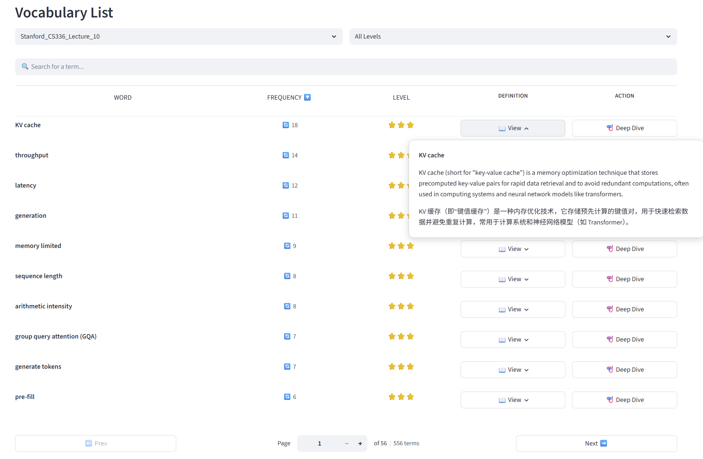
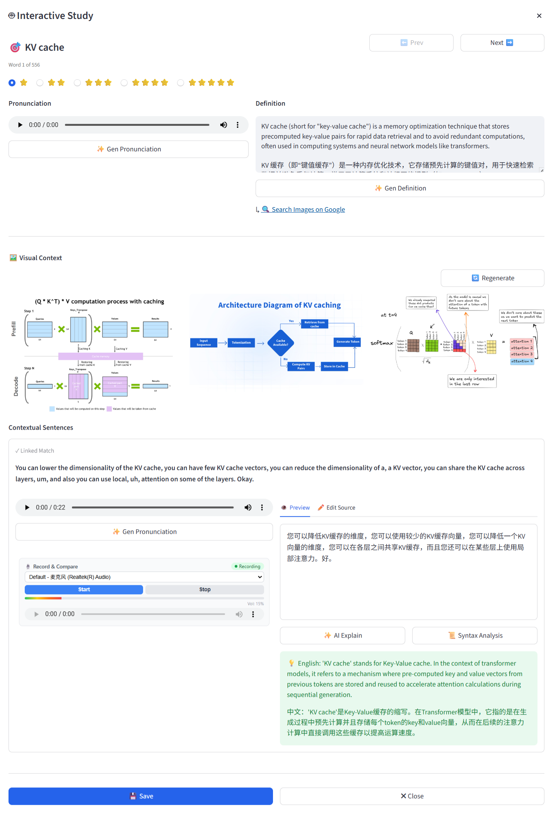
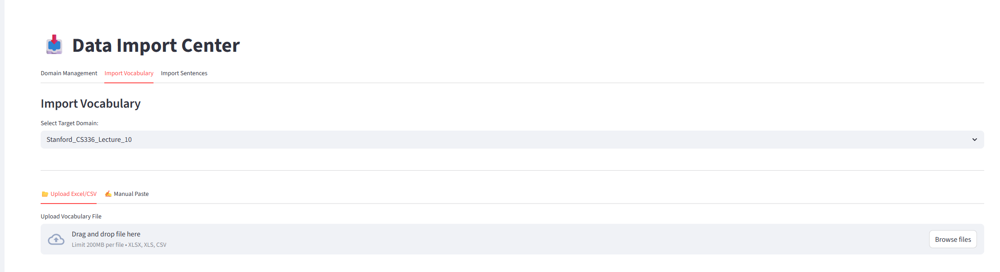

# 🧠 DeepGloss

[](https://www.python.org/downloads/)
[](https://streamlit.io/)
[](https://www.sqlite.org/)
[](https://www.trychroma.com/)
[](https://opensource.org/licenses/MIT)

**DeepGloss** is a smart, domain-specific English learning assistant built with Streamlit and powered by Large Language Models (LLMs) and Vector Database technology.

Unlike generic dictionary apps, DeepGloss focuses on **contextual learning** within specific domains (e.g., "Stanford CS336 Lectures", "Legal English", "Medical Terms"). It allows users to **import customized vocabulary and corpus**, **automatically fetches definitions**, **generates Text-to-Speech (TTS) audio**, **extracts dynamic visual context (images)** to aid in understanding complex professional vocabulary, **provides context-aware AI translations**, and **offers interactive voice recording for pronunciation comparison**. Crucially, it features **Hybrid Search (SQL + Vector)** to find relevant example sentences even when exact keywords are missing.

---

## 📸 Screenshots

**1. Clean & Modern Vocabulary List**  
  
Seamlessly sort, search, and view inline definitions via hover popovers without leaving the page.


**2. Interactive Study Dialog**  
  
Practice pronunciation with the built-in HTML5 mic widget, compare with native TTS, visualize abstract concepts with automatically fetched contextual images, and get AI-powered contextual explanations. The system retrieves sentences via both Keyword Match and Semantic Vector Search.  
  


**3. Smart Data Import Center**  
  
Manage domains and import vocabulary, raw corpus (SQL), and semantic embeddings (VectorDB)  with intelligent deduplication in one place.


---

## ✨ Key Features

### 📥 Smart Data Ingestion
* **Domain Management**: Organize your learning materials into isolated domains.
* **Flexible Import**: Import vocabulary (with frequencies) and contextual sentences via CSV/Excel/TXT uploads or manual entry.
* **Intelligent Deduplication**: Automatically skips existing terms during import (case-insensitive) to maintain a clean database.
* **Vector Indexing**: One-click generation of embeddings for your corpus using the industrial-grade **BGE-M3** model (via ChromaDB) to enable semantic search.

### 📖 Minimalist & Powerful Study Mode
* **Client-side Pagination & Sorting**: Lightning-fast UI with in-memory pagination. Sort vocabulary by Word (A-Z), Frequency, or Importance Level (Stars).
* **Advanced Filtering**: Filter your study list by specific domains or star levels.
* **Real-time Search**: Instantly find terms in your current list with a responsive search bar.
* **Hover Definitions**: Clean UI using popovers to view definitions without leaving the list.

### 🤖 AI-Powered Interactive Study
* **Seamless Navigation**: Switch instantly between words using **"⬅️ Prev"** and **"Next ➡️"** buttons without closing the dialog, ensuring an uninterrupted learning flow.
* **Hybrid Search Engine**: Combines SQLite (Exact Match) and ChromaDB (Semantic Match). If an exact sentence isn't found, it finds the most semantically similar sentence from the VectorDB (e.g., searching "GQA" finds sentences about "Group Query Attention").
* **Context-Aware Explanations**: Uses LLMs to translate sentences and explain *exactly* what a term means within that specific context.
* **Auto-Fetch Definitions**: If a term lacks a definition, the system automatically calls the LLM in the background to fetch a precise English definition and Chinese translation.
* **Visual Context for Professional Vocabulary**:
  * **Multi-Dimensional Image Search**: Grasp complex or abstract terms instantly. The system automatically scrapes Google Images (with Bing as a seamless fallback) using a combined 3-tier strategy: *Term alone*, *Term + Definition*, and *Term + Contextual Sentence* to fetch highly accurate visual representations.
  * **Asynchronous Loading & Randomized Regeneration**: Images load via a non-blocking UI mechanism (with a JS loading spinner) so you can study text while images fetch in the background. Not satisfied with the first batch? Click **Regenerate** to randomly sample a new set of images from a broader candidate pool of top search results, ensuring diverse visual perspectives.
  * **Local Image Caching**: Once saved, images are downloaded directly to your local cache and linked via relative paths in the SQLite database, ensuring zero-latency loads and offline availability for future reviews.
* **Built-in Mic Widget**: Record your own voice directly in the browser and compare it with the generated TTS audio for pronunciation practice.
* **Audio & Pronunciation**: 
  * Generate high-quality TTS audio for words and full sentences on the fly.
  * **Local Audio Caching**: Generated audio is cached locally (path configurable via `config.yaml`) to save API costs and speed up loading.
* **Importance Rating**: Rate terms from 1 to 5 stars (⭐⭐⭐⭐⭐) to prioritize your learning.

---

## 🛠️ Technology Stack

* **Frontend**: [Streamlit](https://streamlit.io/) (Custom CSS, JS & Components)
* **Backend**: Python 3.10+
* **Database**: 
  * **Structured**: SQLite3 (Metadata, Terms, Links, Image/Audio Paths)
  * **Vector**: [ChromaDB](https://www.trychroma.com/) (Semantic Embeddings)
* **AI Models**:
  * **LLM**: OpenAI / DeepSeek / Moonshot (via OpenAI-compatible API)
  * **Embedding**: BAAI/bge-m3 (State-of-the-art English/Chinese embedding)
* **Data Processing**: Pandas, Regex
* **Web Scraping**: Native `urllib` & `re` (Lightweight Google/Bing Image extraction)
* **Config**: YAML + DotEnv


---

## 📂 Project Architecture

DeepGloss follows a clean, modular, and maintainable architecture separating UI, services, and storage logic:

```text
DeepGloss/
├── app/
│   ├── database/        # SQLite logic & schemas
│   │   ├── db_manager.py
│   │   └── schema.sql
│   ├── services/        # AI & Core Services
│   │   ├── ingestion.py     # Text processing
│   │   ├── llm_client.py    # Universal LLM client
│   │   ├── tts_manager.py   # Text-to-Speech with caching
│   │   └── vector_manager.py# ChromaDB Vector operations 
│   ├── ui/              # Modular UI components
│   │   ├── mic_widget.py
│   │   ├── components.py
│   │   └── study_dialog.py
│   └── utils/           # Helper scripts
│       ├── image_scraper.py # Web scraping for contextual images 
│       └── ...
├── data/                # Data Storage
│   ├── audio_cache/     # MP3 Cache (Auto-generated)
│   ├── image_cache/     # Downloaded image assets (Auto-generated)
│   ├── vector_store/    # ChromaDB Files (Auto-generated)
│   └── deepgloss.db     # SQLite Database File
├── pages/               # Streamlit Pages
│   ├── import_data.py   # Data Ingestion (Terms/SQL/Vector)
│   └── study_mode.py    # Main Study Interface
├── .env                 # API Keys (Git ignored)
├── config.py            # Config Loader Script
├── config.yaml          # App Settings (Paths, Models)
├── main.py              # Entry Point
├── requirements.txt     # Python Dependencies
└── start.bat            # Windows Quick-Start Script


```

---

## 🚀 Getting Started

### 1. Prerequisites

* **OS**: Windows, macOS, or Linux.
* **Environment Manager**: [Anaconda](https://www.anaconda.com/) or [Miniconda](https://docs.conda.io/en/latest/miniconda.html).

### 2. Clone the Repository

```bash
git clone https://github.com/Eric-LLMs/DeepGloss.git
cd DeepGloss


```

### 3. Install Dependencies

It is highly recommended to use **Conda** to manage the environment to ensure compatibility with PyTorch and VectorDB dependencies.

```bash
# 1. Create a new Conda environment named 'DeepGloss' with Python 3.10
conda create -n DeepGloss python=3.10 -y

# 2. Activate the environment
conda activate DeepGloss

# 3. Install required packages
# (Pip is used here to ensure strict compatibility with the requirements.txt file)
pip install -r requirements.txt


```

### 4. Configuration

**Step A: API Keys (`.env`)**
Create a `.env` file in the root directory.

```env
# Required: Your LLM API Key (OpenAI, DeepSeek, etc.)
LLM_API_KEY=sk-xxxxxxxxxxxxxxxxxxxx

# Optional: Base URL (Defaults to OpenAI. Change for DeepSeek: https://api.deepseek.com)
LLM_BASE_URL=https://api.openai.com/v1


```

**Step B: App Settings (`config.yaml`)**
Configure storage paths and models.

```yaml
storage:
  # Path to store TTS audio. Relative paths work fine.
  audio_cache_path: "data/audio_cache"
  # Path to store fetched images for visual context.
  image_cache_path: "data/image_cache"

models:
  llm: "o3-mini"      # Model for explanation
  tts: "tts-1-hd"     # Model for speech
  tts_voice: "alloy"


```

### 5. Run the Application

Start the Streamlit development server:

```bash
streamlit run main.py


```

*(Alternatively, simply double-click the start.bat file if you are on Windows.On first run, the system will automatically download the embedding model (~2GB) and initialize databases).*

---

## 💡 How to Use

1. **Create Domain**: Navigate to `Import Data` -> `Domain Management` to start a new topic (e.g., "AI Research Papers").
2. **Import Terms**: Switch to `Import Vocabulary`. Upload your vocabulary CSV or paste text directly.
3. **Build Corpus (Two Layers)**:

* **Layer 1 (SQL)**: Import sentences to `Import Sentences (SQL)` for exact keyword matching.
* **Layer 2 (Vector)**: Import raw text to `Import VectorDB` to enable AI Semantic Search.

4. **Interactive Study**: Navigate to `study_mode` and click the **🤿 Deep Dive** icon to open the modal where you can generate TTS audio, view AI definitions, **record and compare your pronunciation**, get context-aware sentence translations, visually understand concepts via **Images**, navigate seamlessly via Next/Prev buttons, and finally **Save** the best context and visuals to your database.

---

## 📝 License

This project is licensed under the MIT License. See the LICENSE file for details.

```


```